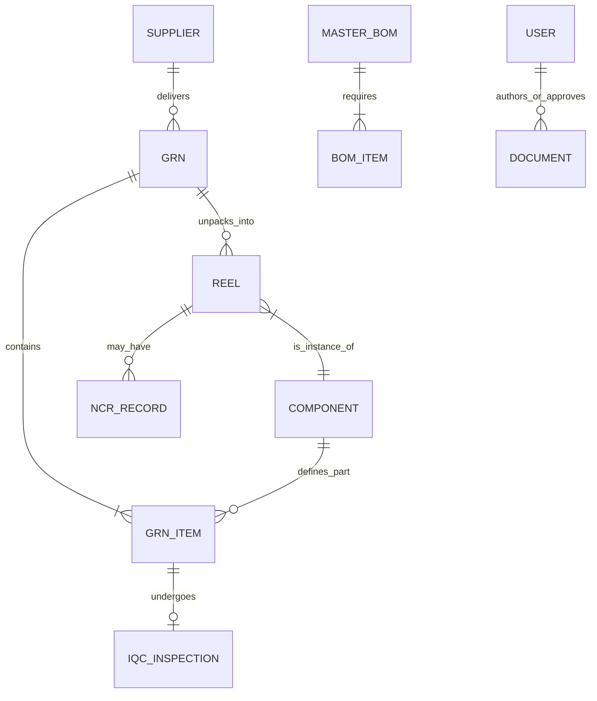

# Prism QMS (Quality Management System)

Prism is a robust, full-stack, ISO 9001:2015 compliant Quality Management System optimized for modern electronics manufacturing. It enforces strict process discipline, reel-level traceability, and maintains comprehensive audit trails.

## 🚀 Tech Stack

- **Framework**: Next.js 14 (App Router) with React 18
- **Database**: MongoDB driven by Prisma ORM
- **Authentication**: NextAuth.js (Role-based access control)
- **Styling UI**: Tailwind CSS (Glassmorphic, Modern Aesthetic)
- **Workflows**: React Flow for visual engine mappings

## 🧠 System Architecture & Core Modules

The application is structured into domain-specific modules mapped in `src/app`:

### 1. Quality Control & Compliance (`/quality`, `/audit`, `/documents`)
- **Incoming Quality Control (IQC)**: Inspectors perform tests on pending GRN items, capturing measurements and moving parts from `QUARANTINE` to `ACCEPTED`/`REJECTED`.
- **Non-Conformance Reports (NCR)**: Tracks defective items, identifies root causes, and manages Corrective and Preventive Action (CAPA) tracking constraints.
- **Document Control**: Full lifecycle control for SOPs (Draft -> In Review -> Approved -> Obsolete) enforcing ISO document standards.
- **Immutable Audit Trails**: Automatically logs every movement, edit, and deletion (creates, updates, scrap tracking) for effortless certification auditing.

### 2. Store & Inventory Control (`/inventory`, `/store`)
- **Store Inventory (Reel Tracking)**: Tracking inventory explicitly at the physical spool/reel level to maintain zero-error traceability.
- **Master BOMs**: Version-controlled production recipes with approved alternate part designations and hierarchical designators.

### 3. Supply Chain (`/purchase`)
- **Supplier Management**: Approved Vendor List (AVL) ensuring goods can only be received from compliant and high-rating vendors.
- **Smart PO & GRN**: Seamless Goods Receipt Notes (GRN) that securely digitize incoming supplier physical deliveries.

### 4. Floor Operations (`/kitting`, `/production`, `/dispatch`, `/testing`)
- **Kitting & Production**: Ensuring accuracy by enforcing physical barcode/QR scans (Scan-To-Verify) of every individual component before kit release.
- **Testing & Dispatch**: End-of-line verification, shipping, and real-time final packaging constraints.

## 📊 Data Mapping (Entity Relationships)



## 🛠 Getting Started

### 1. Prerequisites
- Node.js (v20.x+)
- MongoDB connection string (e.g., MongoDB Atlas)

### 2. Environment Variables
Copy the `.env.example` file to create your own local `.env.local` file:
```bash
cp .env.example .env.local
```

### 3. Installation
Using `npm` to install packages and synchronizing the Prisma schema:
```bash
npm install
npm run postinstall   # Runs `prisma generate`
npm run db:push       # Sync MongoDB schema indices
npm run db:seed       # Apply optional seed data if necessary
```

### 4. Running the Development Server
```bash
npm run dev
```
Navigate to `http://localhost:3000` to view the application. 

---
*Note: This architecture aggressively emphasizes strict physical-vs-digital validation. Manual overrides are restricted where "Scan-to-Verify" processes are present to guarantee ISO 9001 precision.*
